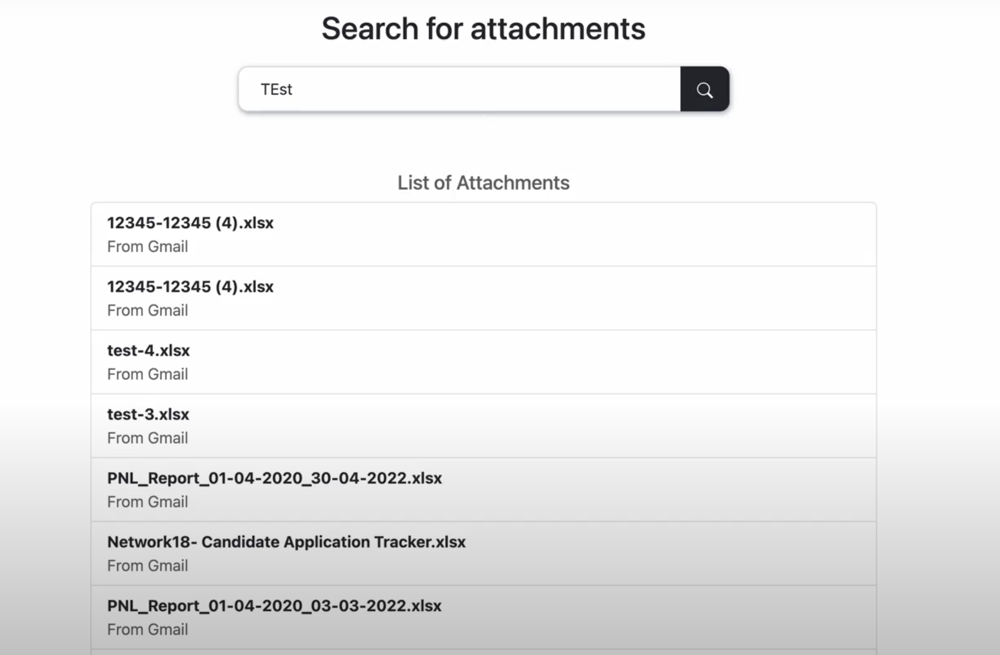

## About
This is a NodeJS application which uses Google OAuth to authenticate users and fetches attachments from their Gmail account based on the search query. The attachments are downloaded on the server and the unique attachment id is stored in the MongoDB database. We can then download the attachment by providing the attachment id.

### UI Snapshot

## Prerequisites
### Setting up MongoDB Project
- Create a new cluster in [MongoDB](https://www.mongodb.com/) to store user and email data. Copy the connection string and add the `MONGO_URI` to the `.env` file

### Setting up project in Google Cloud
- Go to [Google Cloud Console](https://console.cloud.google.com) and create a new project
- Enabling Google API
    - In sidemenu options, select `APIs and Services` -> `Library` -> Search for `Gmail API` and enable it
- Setting up the OAuth Screen
    - Inside `APIs and Services` -> `OAuth Consent Screen` -> Select `User Type` (Select `External` for testing) and click on `Create`
    - Now enter all the application details and click `Save and Continue`
    - Inside `Scopes` section -> `Add Scopes` -> Seach for `Gmail API` and select the `/auth/gmail.readonly` scope. This gives our app access to read the user's emails -> `Save and Continue`
    - If your application is still in `Testing` phase and you selected `External` user type in Step 1, you'll have to provide email ids of all the users who can access your app -> `Save and Continue`
    - Check the app summary and click `Save`
- Generating Credentials
    - Again in `APIs and Services`, select `Credentials` -> `Create Credentials` -> `oAuth Client ID`
    - Select `Application Type` (Web Application), add authorized origin (Use `http://localhost:3000` if you don't have a Domain) and a callback URL where Google will send the response after OAuth (`http://localhost:3000/auth/google/callback` in our case). Also add this as `CALLBACK_URL` in the `.env` file
    - Save you client id and secret as `GOOGLE_CLIENT_ID` and `GOOGLE_CLIENT_SECRET` in the `.env` file

## Setup
- Clone the github repo
- Open terminal, go to the directory and run `npm i`
- Make sure followed all the above steps and added all the variable as specified in the `.sample.env` inside the `.env` file
- Run `npm run dev` which will start a Nodejs server at `localhost:3000`

## Contact
Please feel free to reach out to me at `yashsolanki1709@gmail.com` in case you have any queries.
